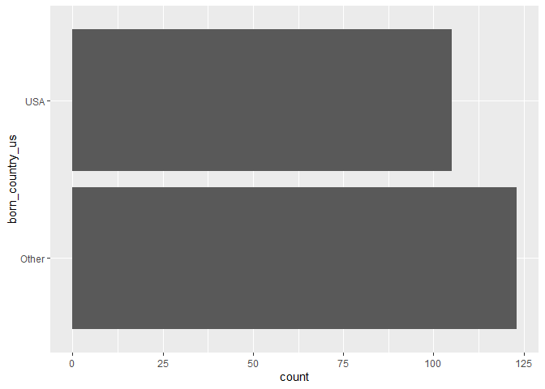

Lab 03 - Nobel laureates
================
Ben Waggener
01/31/2025

### Load packages and data

``` r
library(tidyverse) 
```

``` r
nobel <- read_csv("data/nobel.csv")
```

## Exercises

### Exercise 1

“How many observations and how many variables are in the dataset? Use
inline code to answer this question. What does each row represent?”

``` r
names(nobel)
```

    ##  [1] "id"                    "firstname"             "surname"              
    ##  [4] "year"                  "category"              "affiliation"          
    ##  [7] "city"                  "country"               "born_date"            
    ## [10] "died_date"             "gender"                "born_city"            
    ## [13] "born_country"          "born_country_code"     "died_city"            
    ## [16] "died_country"          "died_country_code"     "overall_motivation"   
    ## [19] "share"                 "motivation"            "born_country_original"
    ## [22] "born_city_original"    "died_country_original" "died_city_original"   
    ## [25] "city_original"         "country_original"

``` r
glimpse(nobel)
```

    ## Rows: 935
    ## Columns: 26
    ## $ id                    <dbl> 1, 2, 3, 4, 5, 6, 6, 8, 9, 10, 11, 12, 13, 14, 1…
    ## $ firstname             <chr> "Wilhelm Conrad", "Hendrik A.", "Pieter", "Henri…
    ## $ surname               <chr> "Röntgen", "Lorentz", "Zeeman", "Becquerel", "Cu…
    ## $ year                  <dbl> 1901, 1902, 1902, 1903, 1903, 1903, 1911, 1904, …
    ## $ category              <chr> "Physics", "Physics", "Physics", "Physics", "Phy…
    ## $ affiliation           <chr> "Munich University", "Leiden University", "Amste…
    ## $ city                  <chr> "Munich", "Leiden", "Amsterdam", "Paris", "Paris…
    ## $ country               <chr> "Germany", "Netherlands", "Netherlands", "France…
    ## $ born_date             <date> 1845-03-27, 1853-07-18, 1865-05-25, 1852-12-15,…
    ## $ died_date             <date> 1923-02-10, 1928-02-04, 1943-10-09, 1908-08-25,…
    ## $ gender                <chr> "male", "male", "male", "male", "male", "female"…
    ## $ born_city             <chr> "Remscheid", "Arnhem", "Zonnemaire", "Paris", "P…
    ## $ born_country          <chr> "Germany", "Netherlands", "Netherlands", "France…
    ## $ born_country_code     <chr> "DE", "NL", "NL", "FR", "FR", "PL", "PL", "GB", …
    ## $ died_city             <chr> "Munich", NA, "Amsterdam", NA, "Paris", "Sallanc…
    ## $ died_country          <chr> "Germany", "Netherlands", "Netherlands", "France…
    ## $ died_country_code     <chr> "DE", "NL", "NL", "FR", "FR", "FR", "FR", "GB", …
    ## $ overall_motivation    <chr> NA, NA, NA, NA, NA, NA, NA, NA, NA, NA, NA, NA, …
    ## $ share                 <dbl> 1, 2, 2, 2, 4, 4, 1, 1, 1, 1, 1, 1, 2, 2, 1, 1, …
    ## $ motivation            <chr> "\"in recognition of the extraordinary services …
    ## $ born_country_original <chr> "Prussia (now Germany)", "the Netherlands", "the…
    ## $ born_city_original    <chr> "Lennep (now Remscheid)", "Arnhem", "Zonnemaire"…
    ## $ died_country_original <chr> "Germany", "the Netherlands", "the Netherlands",…
    ## $ died_city_original    <chr> "Munich", NA, "Amsterdam", NA, "Paris", "Sallanc…
    ## $ city_original         <chr> "Munich", "Leiden", "Amsterdam", "Paris", "Paris…
    ## $ country_original      <chr> "Germany", "the Netherlands", "the Netherlands",…

There are 26 variables and 935 observations. Each row represents an
observation (a nobel laureate).

### Exercise 2

“create a new data frame called nobel_living that filters for laureates
for whom country is available, laureates who are people as opposed to
organizations (organizations are denoted with”org” as their gender), and
laureates who are still alive (their died_date is NA).”

\##use “NA” to indicate that country is unavailable.

``` r
nobel_living <- nobel %>%
  filter(!is.na(country)) %>%
  filter(!is.na(gender)) %>%
  filter(!is.na(died_date))
```

### Exercise 3

Creating the new variable

``` r
nobel_living <- nobel_living %>%
  mutate(
    country_us = if_else(country == "USA", "USA", "Other")
  )
```

Restricting the analysis to only Physics, Medicine, Chemistry, and
Economics.

``` r
nobel_living_science <- nobel_living %>%
  filter(category %in% c("Physics", "Medicine", "Chemistry", "Economics"))
```

Here I created the nobel_living_science dataframe that I will use for
this section.

“Create a faceted bar plot visualizing the relationship between the
category of prize and whether the laureate was in the US when they won
the nobel prize. Interpret your visualization, and say a few words about
whether the Buzzfeed headline is supported by the data.”

``` r
ggplot(nobel_living_science, aes(y = country_us))+
  geom_bar()+
  facet_wrap(~category)
```

<!-- --> This data
does not support the Buzzfeed article claim that “Most living Nobel
laureates were based in the US when they won their prizes”. Instead this
shows that most living nobel laureates were based in places other than
the US. Although it may still be true that the US has the most nobel
laureates but that’s not really what they said.

### Exercise 4

“Create a new variable called born_country_us that has the value”USA” if
the laureate is born in the US, and “Other” otherwise. How many of the
winners are born in the US?”

``` r
nobel_living_science <- nobel_living_science %>%
  mutate(born_country_us = if_else(born_country == "USA", "USA", "Other")
  )


ggplot(nobel_living_science, aes(y = born_country_us))+
  geom_bar()
```

<!-- -->

Looking at this plot, it is clear that while a majority of living nobel
winners were born outside of the us, a surprising number were born in
the us.

### Exercise 5

“Add a second variable to your visualization from Exercise 3 based on
whether the laureate was born in the US or not. Based on your
visualization, do the data appear to support Buzzfeed’s claim? Explain
your reasoning in 1-2 sentences.

Your final visualization should contain a facet for each category.
Within each facet, there should be a bar for whether the laureate won
the award in the US or not. Each bar should have segments for whether
the laureate was born in the US or not.”

``` r
ggplot(nobel_living_science, aes(x = country_us, fill = born_country_us))+
  geom_bar()+
   facet_wrap(~category)
```

<!-- -->
The data does not support buzzfeeds claim that “Most living Nobel
laureates were based in the US when they won their prizes”. Instead it
shows that most living laureates won their prize outside of the US and
most of the winners in the US were born there.

### Exercise 6

“In a single pipeline, filter for laureates who won their prize in the
US, but were born outside of the US, and then create a frequency table
(with the count() function) for their birth country (born_country) and
arrange the resulting data frame in descending order of number of
observations for each country. Which country is the most common?”

``` r
nobel_living_science %>%
  filter(country == "USA", born_country_us == "Other")%>%
  count(born_country) %>%
  arrange(desc(n))
```

    ## # A tibble: 27 × 2
    ##    born_country       n
    ##    <chr>          <int>
    ##  1 Canada             8
    ##  2 United Kingdom     8
    ##  3 Poland             6
    ##  4 France             4
    ##  5 Hungary            4
    ##  6 Italy              4
    ##  7 Russia             4
    ##  8 Austria            3
    ##  9 Germany            3
    ## 10 South Africa       3
    ## # ℹ 17 more rows

…
